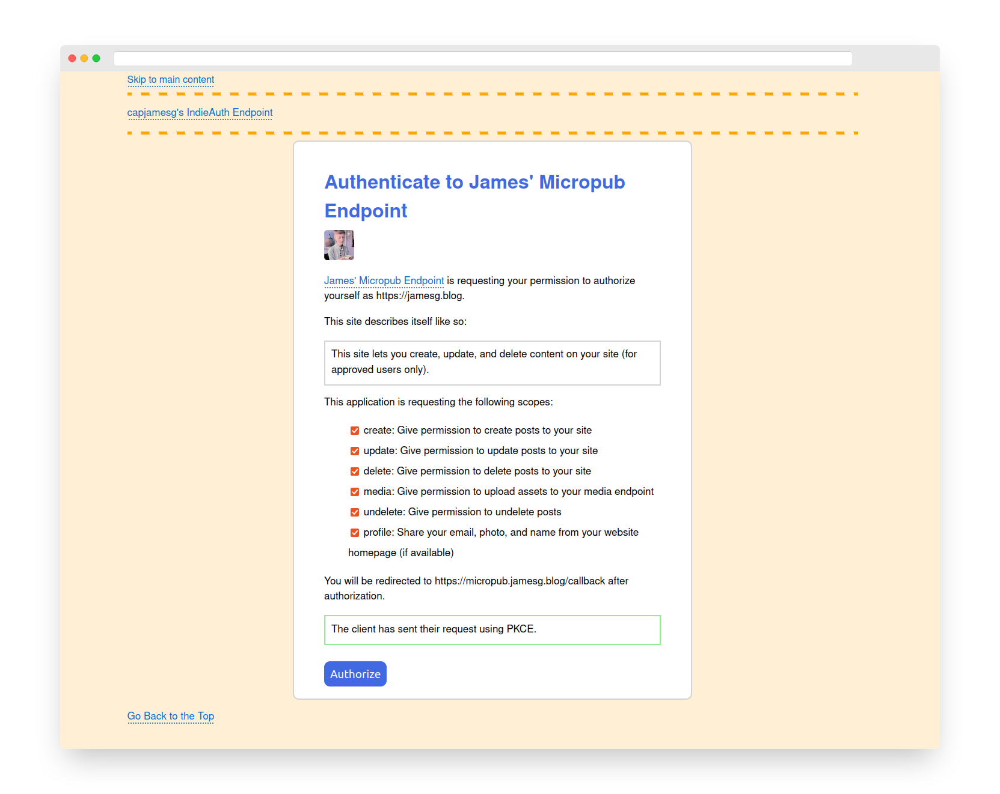

# James' IndieAuth Endpoint

This repository contains the code for my IndieAuth endpoint. This endpoint has been developed in adherence with the [IndieAuth specification](https://indieauth.spec.indieweb.org), a method of authentication built on top of OAuth 2.0.

Using this project, you can authenticate yourself to a service by using RelMeAuth. RelMeAuth requires you have rel="me" links on your blog that link to social profiles. At the moment, this project supports the following rel=me links:

- GitHub

You can also authenticate using Okta Verify's passwordless solution. To do so, you will need to have an active Okta developer account.

## Screenshot

## Setup

To setup this project, first install the required dependencies. You can do this using the following command:

    pip3 install -r requirements.txt

Next, you will need to add some configration variables to a file called config.py.

### Create a configuration file

Create a file called config.py in the root directory of the project. Add the following value to the file:

    ME="https://yourdomain.com"

Then add your GitHub OAuth API keys (leave all values you do not want to specify as ""):

    GITHUB_CLIENT_ID = "ID"
    GITHUB_OAUTH_REDIRECT = "URL"
    GITHUB_CLIENT_SECRET = "SECRET"

You can retrieve these pieces of information by following the GitHub "[Creating an OAuth App](https://docs.github.com/en/developers/apps/building-oauth-apps/creating-an-oauth-app)" guide.

Next, add your Okta API keys (leave all values you do not want to specify as ""):

    OKTA_DOMAIN = "DOMAIN"
    OKTA_ACCESS_TOKEN = "TOKEN"
    OKTA_USER_ID = "ID"
    OKTA_FACTOR_ID = "ID"

You can learn more about Okta and their APIs by reading the [Okta API documentation](https://developer.okta.com/docs/api/getting-started/).

Using the keys above, this application will be able to authenticate you using Twitter, GitHub, and Okta.

### Enabling webhooks (optional)

Optionally, you can set up webhooks so that you receive a notification whenever you authenticate using your endpoint. You should only enable this feature if you are using the endpoint for personal use.

To set up webhooks, add the following three values to your config.py file:

    WEBHOOK_SERVER = True
    WEBHOOK_URL = "https://yourdomain.com/webhook"
    WEBHOOK_API_KEY = "SECRET"

The webhook request will send a JSON payload with the following information:

    {
        "message": "ME has issued an access token to CLIENT_ID"
    }

Where ME is the domain name used to authenticate and CLIENT_ID is the URL of the client with whom you have authenticated.

This webhook is useful for keeping track of when you authenticate.

If you want to leave webhooks disabled, please add the following configuration values to your config.py file:

    WEBHOOK_SERVER = False
    WEBHOOK_URL = ""
    WEBHOOK_API_KEY = ""

### Running the server

Finally, add a secret key to your config.py file:

    SECRET_KEY = "KEY"

This key is used by Flask and is required for this web application to run. Your secret key must be kept secret.

Next, run the IndieAuth server using Flask:

    export FLASK_APP=.
    flask run

If you plan to deploy the server on production, please use an appropriate production deployment method (i.e. using Gunicorn) as you would for any other Flask application.

## Issuing an access token

There are two ways to issue an access token with this endpoint:

1. Sign in with a service that supports IndieAuth and follow the authenication and authorization flows. Authentication is when you sign in and authorization is when you grant an application access to certain permissions.
2. Sign in to the endpoint at /login and issue a token at /issued.

The second approach is useful if you need a testing key for development. You can create a key and then use it in your application without having to worry about getting localhost to work with the authentication and authorization flows.

### Access token management

On the /issued endpoint, you can:

1. Issue access tokens, as aforementioned.
2. View information about issued access tokens (although not full access tokens).
3. Revoke an access token.

When an access token is revoked, it will immediately become invalid as per the revocation guidelines in the [IndieAuth specification](https://indieauth.spec.indieweb.org/).

## Technologies

This project makes use of the following technologies:

- Python Flask
- Beautiful Soup 4 (bs4)
- jwt, hashlib, and base64 for tokens
- HTML and CSS

## Licence

This project is licensed under the [MIT License](LICENSE)

## Contributors

- capjamesg